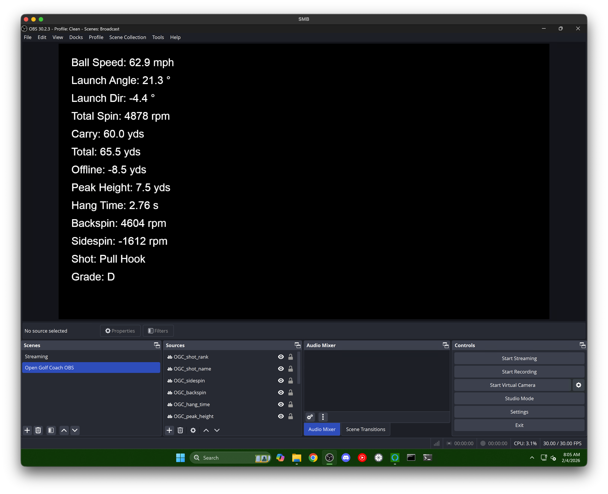

# OBS Open Golf Coach Plugin

Display real-time golf shot data from Nova launch monitor directly in OBS Studio. Each data point appears as a separate, moveable text source.




## Features

- **22 data points** as individual, moveable OBS text sources
- Clubhead speed, smash factor, and distance efficiency metrics
- Estimated club delivery (club path, face to target, face to path)
- Shot classification with named shapes and letter grades
- Toggle labels, units, and individual data points on/off
- Built-in test button to preview layout without a launch monitor

## Requirements

- **OBS Studio** with Python scripting enabled
- **Python 3.10+** - [Download Python](https://www.python.org/downloads/) (use 3.11 for best OBS compatibility)
- **opengolfcoach** pip package (for calculating carry, shot shape, etc.)

## Quick Start

### 1. Install opengolfcoach

Install in the **same Python** that OBS uses:

```bash
pip install opengolfcoach
```

### 2. Add the OBS Script

1. Open **OBS Studio** → `Tools` → `Scripts`
2. Click `Python Settings` tab → set your Python path:
   - Windows: `C:\Users\<username>\AppData\Local\Programs\Python\Python311`
   - Or if installed for all users: `C:\Program Files\Python311`
3. Click `+` → select `obs_open_golf_coach.py`

### 3. Create Sources

1. Select a scene in OBS
2. Click **"Create All Sources"** in the script settings
3. Position the `OGC_` sources on your stream

## How It Works

```
Nova (launch monitor)
    │
    ▼ Port 921 (OpenAPI protocol)
┌─────────────────────────────┐
│  OBS Script                 │
│  - Sends handshake          │
│  - Keeps connection alive   │
│  - Converts OpenAPI format  │
│  - Calculates with OGC lib  │
│  - Updates text sources     │
└─────────────────────────────┘
    │
    ▼
OBS Text Sources (moveable)
```

## Data Points

### Input Metrics

| Source | Description |
|--------|-------------|
| `OGC_ball_speed` | Ball speed (mph) |
| `OGC_clubhead_speed` | Club speed (mph) |
| `OGC_smash_factor` | Smash factor (ball speed / club speed) |
| `OGC_launch_angle` | Vertical launch angle (°) |
| `OGC_launch_direction` | Horizontal launch direction (°) |
| `OGC_total_spin` | Total spin rate (rpm) |

### Calculated Metrics

| Source | Description |
|--------|-------------|
| `OGC_carry` | Carry distance (yds) |
| `OGC_total` | Total distance (yds) |
| `OGC_offline` | Offline / left-right distance (yds) |
| `OGC_peak_height` | Peak height (yds) |
| `OGC_hang_time` | Hang time (s) |

### Spin Breakdown

| Source | Description |
|--------|-------------|
| `OGC_spin_axis` | Spin axis (°) |
| `OGC_backspin` | Backspin (rpm) |
| `OGC_sidespin` | Sidespin (rpm) |

### Trajectory

| Source | Description |
|--------|-------------|
| `OGC_descent_angle` | Descent angle (°) |

### Efficiency

| Source | Description |
|--------|-------------|
| `OGC_distance_efficiency` | Distance efficiency (%) |
| `OGC_optimal_max_distance` | Optimal max distance for the ball speed (yds) |

### Club Delivery (Estimated)

| Source | Description |
|--------|-------------|
| `OGC_club_path` | Club path (°) |
| `OGC_face_to_target` | Face angle to target (°) |
| `OGC_face_to_path` | Face angle to path (°) |

### Shot Classification

| Source | Description |
|--------|-------------|
| `OGC_shot_name` | Shot shape (Fade, Draw, etc.) |
| `OGC_shot_rank` | Quality grade (S, A, B, C, D) |

## Troubleshooting

**"opengolfcoach NOT installed"** in script description:
- Install with `pip install opengolfcoach`
- Make sure you're using the same Python that OBS is configured to use

**No clubhead speed or smash factor:**
- Nova must send `ClubData` alongside `BallData` — check that your Nova firmware supports club data

**Connection drops after one shot:**
- Update to the latest script version (implements keep-alive)

**Sources not appearing:**
- Make sure a scene is selected before clicking "Create All Sources"

## License

MIT License
