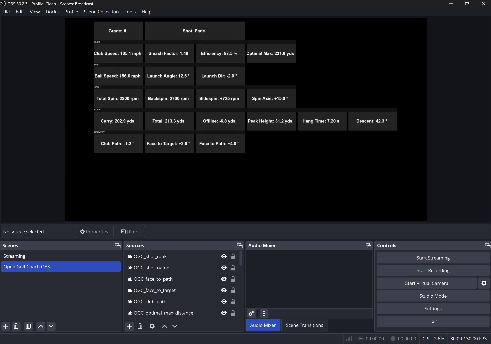

# OBS Open Golf Coach Plugin

Display real-time golf shot data from Nova launch monitor directly in OBS Studio. Sources are automatically arranged in a broadcast-quality dashboard grid grouped by category.



## Features

- **22 data points** as individual OBS text sources in a grouped dashboard grid
- **Category headers** — CLUB, BALL, SPIN, FLIGHT, DELIVERY
- Dark background boxes with centered bold text for broadcast readability
- Clubhead speed, smash factor, distance efficiency, and optimal max distance
- Estimated club delivery (club path, face to target, face to path)
- Shot classification with named shapes (Fade, Draw, Pull Slice, etc.) and letter grades
- Toggle labels, units, and individual data points on/off
- Built-in test button to preview the dashboard without a launch monitor

## Install

### Option A: Windows Installer (Recommended)

1. Download **OpenGolfCoach-OBS-Setup.exe** from the [latest release](https://github.com/TaylorOpenLaunch/OBS_OpenGolfCoach_Plugin/releases)
2. Run the installer — it bundles Python 3.12 and the `opengolfcoach` library so you don't need to install Python yourself
3. The installer places files at:
   ```
   %APPDATA%\obs-studio\ogc-python\
   ├── python.exe              ← bundled Python 3.12
   ├── scripts\
   │   └── obs_open_golf_coach.py   ← the OBS plugin script
   ├── README.md
   └── LICENSE
   ```
4. The installer automatically configures OBS to use the bundled Python
5. Open **OBS Studio** → `Tools` → `Scripts` → click `+` → browse to:
   ```
   %APPDATA%\obs-studio\ogc-python\scripts\obs_open_golf_coach.py
   ```
6. Click **"Create All Sources"** in the script settings
7. Connect your Nova launch monitor on port 921

### Option B: Build from Source

Requires **Python 3.10+** ([download](https://www.python.org/downloads/) — use 3.11 or 3.12 for best OBS compatibility).

1. Clone the repository:
   ```bash
   git clone https://github.com/TaylorOpenLaunch/OBS_OpenGolfCoach_Plugin.git
   ```

2. Install the `opengolfcoach` library in the **same Python** that OBS uses:
   ```bash
   pip install opengolfcoach
   ```

3. Open **OBS Studio** → `Tools` → `Scripts` → `Python Settings` tab → set your Python path:
   - `C:\Users\<username>\AppData\Local\Programs\Python\Python312`
   - Or if installed for all users: `C:\Program Files\Python312`

4. Click `+` → select `obs_open_golf_coach.py` from the cloned repo

5. Click **"Create All Sources"** in the script settings

#### Building the Installer

To build the Windows installer yourself:

```powershell
# 1. Prepare the bundled Python environment
cd installer
powershell -ExecutionPolicy Bypass -File setup-python.ps1

# 2. Build with Inno Setup (requires Inno Setup 6 installed)
iscc /DAppVersion="1.2.0" installer.iss
```

The output installer will be at `build/installer-output/OpenGolfCoach-OBS-Setup.exe`.

## How It Works

```
Nova (launch monitor)
    │
    ▼ Port 921 (OpenAPI protocol)
┌─────────────────────────────┐
│  OBS Script                 │
│  - Sends handshake          │
│  - Keeps connection alive   │
│  - Converts OpenAPI format  │
│  - Calculates with OGC lib  │
│  - Updates text sources     │
└─────────────────────────────┘
    │
    ▼
OBS Dashboard Grid (22 sources)
```

## Data Points

| Category | Sources |
|----------|---------|
| **Shot** | Grade, Shot Shape |
| **Club** | Club Speed, Smash Factor, Efficiency, Optimal Max |
| **Ball** | Ball Speed, Launch Angle, Launch Direction |
| **Spin** | Total Spin, Backspin, Sidespin, Spin Axis |
| **Flight** | Carry, Total, Offline, Peak Height, Hang Time, Descent Angle |
| **Delivery** | Club Path, Face to Target, Face to Path |

## Troubleshooting

**"opengolfcoach NOT installed"** in script description:
- Installer users: re-run the installer
- Source users: `pip install opengolfcoach` using the same Python that OBS is configured to use

**No clubhead speed or smash factor:**
- Nova must send `ClubData` alongside `BallData` — check that your Nova firmware supports club data

**Sources not appearing:**
- Make sure a scene is selected before clicking "Create All Sources"

**Connection drops after one shot:**
- Update to the latest plugin version (implements keep-alive)

## License

MIT License
